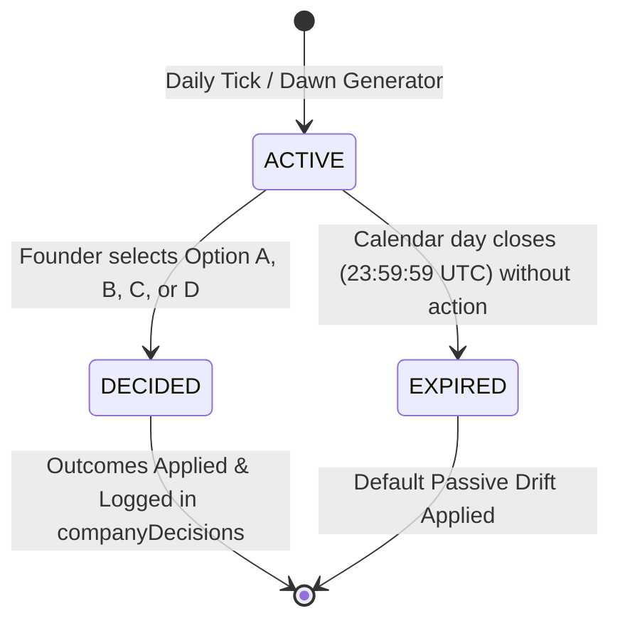

# SIMULATION_DESIGN.md — CorpVerse Deterministic Company Simulation Engine

## 1. Executive Overview & Design Principles

The CorpVerse Company Simulation Engine powers founder-led enterprise operations. It is governed strictly by Specification Sections 7, 8, 14, 15, 21, 22, 26 (Collections 7, 8, 9, 24, 25, 26), Decisions D12, D14, and ADR-020.

### 1.1 Fundamental Architecture Principles

1. **The Backend is Authoritative; AI is Advisory:**
   - Under no circumstances does an LLM directly set or modify financial figures, employee headcount, company rating, or financial health.
   - The AI Gateway (`PIPELINE` pool) generates rich business dilemma narratives and option descriptions.
   - The backend validates all inputs against strict Zod schemas, enforces bounded numeric modifier tables, and executes deterministic mathematical formulas.
2. **Zero Magic Numbers in Business Logic:**
   - Baseline revenue multipliers, expense rates, bot upkeep, bankruptcy thresholds, and workforce caps are sourced from `PlatformConfig` or defined in version-controlled configuration tables.
3. **Double-Entry Financial Integrity:**
   - Every daily tick generates an immutable record in `companyFinancials` (Spec Collection 26) capturing revenue, expenses, net profit, financial health, and employee retention rate.
4. **Resilience & Idempotency:**
   - A company executes at most **1 daily tick per calendar day** (UTC key `YYYY-MM-DD`). Re-executing a tick for an existing date key returns the existing snapshot.

---

## 2. Core Simulation State Variables

Each active company maintains state variables tracked across two layers: live fields on the `Company` model and point-in-time snapshots in `companyFinancials`.

| Variable | Symbol | Data Type | Bounds / Clamping | Default Value | Source / Description |
| :--- | :---: | :---: | :---: | :---: | :--- |
| **Daily Revenue** | $R_{\text{day}}$ | Integer | $[0, +\infty)$ | $100$ | Computed daily CorpCoin earned from operations and scenario choices |
| **Daily Expenses** | $E_{\text{day}}$ | Integer | $[0, +\infty)$ | $80$ | Computed daily CorpCoin spent on base overhead, payroll, bot upkeep, and scenario choices |
| **Daily Profit** | $\Pi_{\text{day}}$ | Integer | $(-\infty, +\infty)$ | $0$ | Net change in financial health: $\Pi_{\text{day}} = R_{\text{day}} - E_{\text{day}}$ |
| **Financial Health** | $H$ | Integer | $[-1000, +\infty)$ | $0$ | Cumulative capital balance in CorpCoin. Liquidation occurs at $H \le -1000$ |
| **Company Rating** (Reputation) | $Q$ | Integer | $[0, 100]$ | $50$ | Enterprise prestige, client trust, and brand market value |
| **Employee Satisfaction** | $S$ | Integer | $[0, 100]$ | $70$ | Team morale, internal culture, and satisfaction with leadership |
| **Average Productivity** | $P$ | Float | $[0.00, 1.00]$ | $0.50$ | Normalized workforce execution efficiency derived from recent employee task evaluation scores |
| **Employee Retention Rate** | $T$ | Float / % | $[0.0, 100.0]$ | $100.0$ | Cumulative percentage of retained employees without voluntary departure or discipline exits |
| **Active Employee Count** | $N$ | Integer | $[0, 20]$ | $0$ | Number of active employees on company roster ($N \le \text{maxEmployees}$) |
| **Active Bot Count** | $B$ | Integer | $[3, 6]$ | $3$ | Number of acquired AI workforce bots (Hiring, Task, Evaluation) |
| **Cumulative Revenue** | $R_{\text{cum}}$ | Integer | $[0, +\infty)$ | $0$ | All-time accumulated gross CorpCoin revenue generated |
| **Cumulative Profit** | $\Pi_{\text{cum}}$ | Integer | $(-\infty, +\infty)$ | $0$ | All-time accumulated net profit (used for ranking leaderboards) |
| **Operating Days** | $D$ | Integer | $[0, +\infty)$ | $0$ | Total number of daily ticks processed since company founding |

---

## 3. Employee & Bot Influence Mechanisms

The company simulation directly couples employee performance (P7.x) and workforce size with the company's financial and reputational progression.

### 3.1 Productivity Calculation ($P$)

Productivity measures how effectively the workforce executes engineering tasks:

1. **Window:** Computed across all tasks evaluated for company employees within the active calendar day (or a rolling 7-day lookback if daily volume is low).
2. **Formula:**
   $$\text{avgScore} = \begin{cases} \frac{1}{K} \sum_{i=1}^{K} \text{score}_i, & K > 0 \\ 50, & K = 0 \text{ (baseline when no tasks evaluated)} \end{cases}$$
   $$\text{productivity } P = \frac{\text{avgScore}}{100} \in [0.00, 1.00]$$
3. **Workforce Multiplier Effect:**
   - In a solo company ($N = 0$), the founder relies solely on base platform revenue ($100$ CorpCoin).
   - In an enterprise ($N > 0$), workforce production generates $N \times P \times 5$ CorpCoin daily.
   - Example: 10 employees averaging 90 score ($P = 0.90$) generate $10 \times 0.90 \times 5 = 45$ bonus CorpCoin daily.
   - Example: 10 employees averaging 30 score ($P = 0.30$) generate $10 \times 0.30 \times 5 = 15$ bonus CorpCoin daily.

### 3.2 Workforce Size & Operational Costs ($N, B$)

1. **Labor Overhead:**
   - Each employee costs a flat **$10$ CorpCoin daily overhead** (equipment, licensing, infrastructure).
   - In addition, employee salary is simulated in annual units, with daily base upkeep integrated into $N \times 10$.
2. **AI Bot Upkeep:**
   - Each active bot requires **$10$ CorpCoin daily compute maintenance**.
   - With the 3 basic bots required for hiring (`HIRING_BOT`, `TASK_BOT`, `EVALUATION_BOT`), bot overhead is fixed at $3 \times 10 = 30$ CorpCoin daily.

### 3.3 Employee Satisfaction ($S$) & Retention ($T$)

1. **Natural Morale Feedback:**
   - Average score $\ge 75$ (Good/Excellent): $+1$ satisfaction daily.
   - Average score $\le 39$ (Poor / Disciplinary warnings issued): $-2$ satisfaction per warning.
   - Unmitigated negative scenarios: $-5$ to $-15$ satisfaction.
2. **Retention Impact:**
   - If satisfaction $S \ge 60$: Retention rate remains stable ($100\%$).
   - If satisfaction $S < 40$: High stress environment; retention degrades by $-2\%$ daily.
   - If satisfaction $S < 20$: Critical crisis; retention degrades by $-5\%$ daily.
   - When retention drops below $70\%$, a risk of voluntary employee resignation is triggered during daily tick processing.

### 3.4 Reputation ($Q$)

1. **Performance Feedback:**
   - High average task quality ($P \ge 0.80$) yields $+1$ reputation point weekly.
   - High employee turnover or bankrupt operations yields negative reputation shifts.
2. **Revenue Feed:**
   - Reputation feeds directly into commercial revenue: $Q \times 2$ CorpCoin daily.
   - At rating $50$: yields $+100$ CorpCoin daily.
   - At rating $80$: yields $+160$ CorpCoin daily.

---

## 4. Daily Business Scenario Architecture (`companyScenarios`)

Each calendar day, every active founder receives exactly **1 business dilemma** requiring strategic judgment.

### 4.1 Lifecycle States



- **`ACTIVE`:** Scenario is awaiting founder review and decision.
- **`DECIDED`:** Founder made an explicit choice. Modifiers are authoritatively calculated and applied.
- **`EXPIRED`:** Founder failed to decide before day rollover; a passive default outcome (Option D or default drift) is applied.

### 4.2 Data Collection Schema

#### Collection 24: `companyScenarios`
```typescript
interface ICompanyScenario {
  _id: Types.ObjectId;
  companyId: Types.ObjectId;
  founderId: Types.ObjectId;
  date: string; // YYYY-MM-DD (unique with companyId)
  scenarioPrompt: string; // Narrative context (100–1000 chars)
  category: 'PRODUCT' | 'ENGINEERING' | 'CLIENT' | 'CULTURE' | 'FINANCE';
  options: IScenarioOption[];
  status: 'ACTIVE' | 'DECIDED' | 'EXPIRED';
  chosenOptionId?: string;
  calculatedDelta?: IScenarioModifier;
  createdAt: Date;
  updatedAt: Date;
}
```

#### Collection 25: `companyDecisions`
```typescript
interface ICompanyDecision {
  _id: Types.ObjectId;
  companyId: Types.ObjectId;
  founderId: Types.ObjectId;
  scenarioId: Types.ObjectId;
  date: string; // YYYY-MM-DD
  chosenOptionId: string;
  calculatedDelta: IScenarioModifier;
  rationale?: string;
  createdAt: Date;
}
```

### 4.3 Structured Scenario Options & Bounded Modifier Catalog

Every scenario provides **3 to 4 distinct options**. Each option maps to bounded numeric modifiers owned and validated by the backend:

```typescript
interface IScenarioModifier {
  revenueModifier: number;      // Bounds: [-50, +150] CorpCoin
  expenseModifier: number;      // Bounds: [-30, +100] CorpCoin
  immediateCost: number;        // Bounds: [0, 200] CorpCoin (one-time deduction)
  satisfactionDelta: number;    // Bounds: [-15, +15] points
  reputationDelta: number;      // Bounds: [-10, +10] points
  productivityDelta: number;    // Bounds: [-0.15, +0.15]
}

interface IScenarioOption {
  optionId: 'A' | 'B' | 'C' | 'D';
  title: string;                // Short option summary (max 80 chars)
  description: string;          // Strategic explanation (max 300 chars)
  expectedOutcome: string;      // Qualitative advisory preview
  modifiers: IScenarioModifier; // Strictly bounded backend values
}
```

### 4.4 The AI Gateway Role Boundary

- **AI Responsibilities:**
  1. Writes the narrative dilemma (`scenarioPrompt`) based on the company's domain, current employee level, and financial situation.
  2. Synthesizes 3–4 believable options with titles, descriptions, and qualitative rationale.
  3. Selects modifier profiles from a backend-approved catalog (e.g., `AGGRESSIVE_EXPANSION`, `AUSTERITY`, `EMPLOYEE_WELLBEING`, `PR_CAMPAIGN`, `STATUS_QUO`).
- **Backend Guarantees:**
  1. Validates structured JSON via Zod schema.
  2. Clamps all numeric modifiers strictly to defined minimum and maximum bounds.
  3. If AI generation fails, falls back to a deterministic pre-seeded standard scenario from `PlatformConfig`.

---

## 5. Step-by-Step Daily Tick Formula

The simulation executes on-demand when the founder accesses the dashboard or during an automated end-of-day tick.

### Step 1: Input Aggregation & Ingestion
Fetch active company state:
- Active headcount: $N = \text{company.employeeCount} \in [0, 20]$
- Active bot count: $B = \text{company.botCount} \ge 3$
- Baseline company rating: $Q = \text{company.companyRating} \in [0, 100]$
- Baseline financial health: $H_{\text{prev}} = \text{company.financialHealth}$
- Average workforce score: Calculate from today's evaluated tasks; normalize to $P \in [0.00, 1.00]$.

### Step 2: Scenario Resolution
Determine scenario modifier deltas:
- If founder selected an option: $\Delta_{\text{scenario}} = \text{option.modifiers}$.
- If scenario expired without selection: $\Delta_{\text{scenario}} = \text{DEFAULT\_EXPIRED\_MODIFIERS}$ (small passive drift: $0$ revenue, $+0$ expenses, $-2$ satisfaction, $-1$ reputation).

### Step 3: Daily Revenue Computation
$$\text{baseRevenue} = 100 + (N \times P \times 5) + (Q \times 2)$$
$$\text{dailyRevenue} = \max(0, \text{baseRevenue} + \Delta_{\text{scenario}}.\text{revenueModifier})$$

### Step 4: Daily Expenses Computation
$$\text{baseExpenses} = 50 + (N \times 10) + (B \times 10)$$
$$\text{dailyExpenses} = \max(0, \text{baseExpenses} + \Delta_{\text{scenario}}.\text{expenseModifier} + \Delta_{\text{scenario}}.\text{immediateCost})$$

### Step 5: Net Profit & Financial Health Update
$$\text{dailyProfit} = \text{dailyRevenue} - \text{dailyExpenses}$$
$$H_{\text{new}} = H_{\text{prev}} + \text{dailyProfit}$$

### Step 6: Secondary Metrics Adjustment & Clamping
- **Company Rating ($Q$):**
  $$Q_{\text{new}} = \text{clamp}(Q_{\text{prev}} + \Delta_{\text{scenario}}.\text{reputationDelta}, 0, 100)$$
- **Employee Satisfaction ($S$):**
  $$S_{\text{new}} = \text{clamp}(S_{\text{prev}} + \Delta_{\text{scenario}}.\text{satisfactionDelta}, 0, 100)$$
- **Employee Retention ($T$):**
  $$T_{\text{new}} = \begin{cases} T_{\text{prev}}, & S_{\text{new}} \ge 60 \\ \max(0, T_{\text{prev}} - 2.0), & 40 \le S_{\text{new}} < 60 \\ \max(0, T_{\text{prev}} - 5.0), & S_{\text{new}} < 40 \end{cases}$$

### Step 7: Bankruptcy Invariant Check ($H_{\text{new}} \le -1000$)
Read threshold from `PlatformConfig.company.bankruptcyThreshold` (default: $-1000$).
If $H_{\text{new}} \le -1000$:
1. Mark company status: `status = 'BANKRUPT'`.
2. Revert founder career role: `user.careerRole = 'JOB_SEEKER'`.
3. Founder retains lifelong total accumulated EXP, personal CorpCoin balance, and history.
4. Terminate active company employees: `status = 'TERMINATED'`, revert their `careerRole` to `JOB_SEEKER`.
5. Close all company jobs: `status = 'CLOSED'`, `isOpen = false`.
6. Dispatch `COMPANY_BANKRUPT` notification to founder and laid-off employees.
7. Record immutable audit log entry.

### Step 8: Persistence & Double-Entry Recording
1. Write point-in-time record to `companyFinancials` (Collection 26):
   - `revenue`: $\text{dailyRevenue}$
   - `expenses`: $\text{dailyExpenses}$
   - `profit`: $\text{dailyProfit}$
   - `financialHealth`: $H_{\text{new}}$
   - `employeeRetentionRate`: $T_{\text{new}}$
   - `recordedAt`: current timestamp.
2. Update `Company` document with updated metrics ($H_{\text{new}}$, $Q_{\text{new}}$, etc.).
3. Update `companyScenarios` status to `'DECIDED'` or `'EXPIRED'`.
4. Record `companyDecisions` document (Collection 25).

---

## 6. Ranking Inputs & Leaderboard Alignment

The simulation feeds directly into the global company leaderboards per Specification Section 15.2:

```
┌──────────────────────────────────────┬────────────────────────────────────────────────────────┐
│ Leaderboard                          │ Underlying Simulation Field                            │
├──────────────────────────────────────┼────────────────────────────────────────────────────────┤
│ 1. Highest Net Profit                │ cumulativeProfit = sum(dailyProfit across all ticks)  │
│ 2. Highest Cumulative Revenue        │ cumulativeRevenue = sum(dailyRevenue across ticks)    │
│ 3. Largest Active Workforce          │ employeeCount (current active employees, max 20)      │
│ 4. Best Employee Retention Rate      │ companyFinancials.employeeRetentionRate               │
│ 5. Highest Company Reputation        │ companyRating (0–100)                                 │
│ 6. Fastest Growing Company           │ 7-day delta in employeeCount and cumulativeRevenue    │
└──────────────────────────────────────┴────────────────────────────────────────────────────────┘
```

All ranking queries run deterministically over indexed fields (`{ cumulativeProfit: -1 }`, `{ companyRating: -1 }`), guaranteeing that no client-side or AI claim can influence standing.

---

## 7. Worked Numeric Examples

### Example 1: A Good Day (Profitable Operations + Strategic Decision)

#### Initial State:
- Workforce: $N = 8$ employees
- AI Bots: $B = 3$ bots (Hiring, Task, Evaluation)
- Reputation: $Q = 65$ / 100
- Initial Financial Health: $H = +150$ CorpCoin
- Employee Task Scores today: Average score $= 86$ $\implies P = 0.86$
- Employee Satisfaction: $S = 75$

#### Daily Scenario Dilemma:
*“Enterprise Client Offers High-Value Long-Term Service Agreement”*
- **Founder Chooses Option A (Accept & Optimize):**
  - $\Delta \text{revenue} = +40$
  - $\Delta \text{expense} = +15$
  - $\text{immediateCost} = 0$
  - $\Delta \text{satisfaction} = +2$
  - $\Delta \text{reputation} = +3$

#### Formula Step-by-Step:
1. **Base Revenue:**
   $$\text{baseRevenue} = 100 + (8 \times 0.86 \times 5) + (65 \times 2) = 100 + 34.4 + 130 = 264.4 \rightarrow 264$$
2. **Total Revenue:**
   $$\text{dailyRevenue} = 264 + 40 = 304 \text{ CorpCoin}$$
3. **Base Expenses:**
   $$\text{baseExpenses} = 50 + (8 \times 10) + (3 \times 10) = 50 + 80 + 30 = 160 \text{ CorpCoin}$$
4. **Total Expenses:**
   $$\text{dailyExpenses} = 160 + 15 + 0 = 175 \text{ CorpCoin}$$
5. **Net Profit:**
   $$\text{dailyProfit} = 304 - 175 = +129 \text{ CorpCoin}$$
6. **Updated Financial Health:**
   $$H_{\text{new}} = 150 + 129 = +279 \text{ CorpCoin}$$
7. **Secondary Metrics:**
   - Reputation: $65 + 3 = 68$
   - Satisfaction: $75 + 2 = 77$
   - Retention: $100.0\%$ (unchanged)

*Outcome: Healthy positive cash flow, expanding reputation, strong employee morale.*

---

### Example 2: A Bad Day (Underperforming Team + Costly Crisis)

#### Initial State:
- Workforce: $N = 12$ employees
- AI Bots: $B = 3$ bots
- Reputation: $Q = 45$ / 100
- Initial Financial Health: $H = -200$ CorpCoin
- Employee Task Scores today: Average score $= 32$ (Deficiencies detected) $\implies P = 0.32$
- Employee Satisfaction: $S = 48$

#### Daily Scenario Dilemma:
*“Production Cloud Database Outage Due to Inadequate Indexing”*
- **Founder Chooses Option C (Emergency Contractor Patch):**
  - $\Delta \text{revenue} = -20$
  - $\Delta \text{expense} = +30$
  - $\text{immediateCost} = 50$
  - $\Delta \text{satisfaction} = -8$
  - $\Delta \text{reputation} = -4$

#### Formula Step-by-Step:
1. **Base Revenue:**
   $$\text{baseRevenue} = 100 + (12 \times 0.32 \times 5) + (45 \times 2) = 100 + 19.2 + 90 = 209.2 \rightarrow 209$$
2. **Total Revenue:**
   $$\text{dailyRevenue} = \max(0, 209 - 20) = 189 \text{ CorpCoin}$$
3. **Base Expenses:**
   $$\text{baseExpenses} = 50 + (12 \times 10) + (3 \times 10) = 50 + 120 + 30 = 200 \text{ CorpCoin}$$
4. **Total Expenses:**
   $$\text{dailyExpenses} = 200 + 30 + 50 = 280 \text{ CorpCoin}$$
5. **Net Profit:**
   $$\text{dailyProfit} = 189 - 280 = -91 \text{ CorpCoin}$$
6. **Updated Financial Health:**
   $$H_{\text{new}} = -200 + (-91) = -291 \text{ CorpCoin}$$
7. **Secondary Metrics:**
   - Reputation: $45 - 4 = 41$
   - Satisfaction: $48 - 8 = 40$
   - Retention: $98.0\%$ (stress penalty begins)

*Outcome: Negative cash flow, capital depleted further, warning signs of insolvency.*

---

### Example 3: The Bankruptcy Path (Insolvency Crossing $-1000$ Threshold)

This trace demonstrates the deterministic liquidation sequence across consecutive loss-making days:

| Day | Starting Health ($H$) | Headcount ($N$) | Productivity ($P$) | Scenario Cost/Penalty | Revenue | Expenses | Profit ($\Pi$) | Ending Health ($H$) | Company State |
| :---: | :---: | :---: | :---: | :---: | :---: | :---: | :---: | :---: | :--- |
| **Day 1** | $-650$ | 15 | $0.25$ | $-30$ Rev, $+40$ Exp | $169$ | $270$ | $-101$ | $-751$ | ACTIVE (Warning issued) |
| **Day 2** | $-751$ | 15 | $0.20$ | $-50$ Rev, $+50$ Exp | $145$ | $280$ | $-135$ | $-886$ | ACTIVE (Critical debt alert) |
| **Day 3** | $-886$ | 14 | $0.30$ | Expired Scenario (passive) | $181$ | $220$ | $-39$ | $-925$ | ACTIVE (Insolvency imminent) |
| **Day 4** | $-925$ | 14 | $0.15$ | Heavy client lawsuit penalty | $130$ | $250$ | $-120$ | **$-1045$** | **LIQUIDATED: BANKRUPT** |

#### Day 4 Bankruptcy Execution Event:
1. $H = -1045 \le -1000$ triggers immediate insolvency protocol.
2. `Company.status` transitions from `'ACTIVE'` to `'BANKRUPT'`.
3. Founder careerRole transitions from `'FOUNDER'` to `'JOB_SEEKER'`.
4. Founder keeps all accumulated lifetime EXP ($12,000+$) and personal CorpCoin balance ($150+$ remaining from startup grant).
5. All 14 active employees are formally released (`CompanyEmployee.status = 'TERMINATED'`), reverting their roles to `'JOB_SEEKER'`.
6. All open job postings are closed (`status = 'CLOSED'`, `isOpen = false`).
7. Double-entry ledger audit record `COMPANY_BANKRUPTCY_LIQUIDATION` is sealed.

---

## 8. Summary of Backend Files & Collections to Implement (P8.4 & P8.5)

| Component | Responsibility | Implementation Phase |
| :--- | :--- | :---: |
| **`docs/SIMULATION_DESIGN.md`** | Complete specification and design artifact (This Document) | **P8.4 (Design Phase)** |
| **`models/CompanyScenario.ts`** | Mongoose schema for Spec Collection 24 (`companyScenarios`) | P8.4 (Implementation Phase) |
| **`models/CompanyDecision.ts`** | Mongoose schema for Spec Collection 25 (`companyDecisions`) | P8.4 (Implementation Phase) |
| **`models/CompanyFinancials.ts`**| Mongoose schema for Spec Collection 26 (`companyFinancials`) | P8.4 (Implementation Phase) |
| **`services/simulation/simulation.service.ts`** | Pure deterministic math engine, daily tick runner, bankruptcy handler | P8.4 (Implementation Phase) |
| **`routes/simulation.routes.ts`** | Endpoints for daily scenario retrieval, option selection, and tick preview | P8.4 (Implementation Phase) |

---

## 9. Approval Request

> [!IMPORTANT]
> This design document specifies the complete deterministic company simulation engine, mathematical formulas, bounded modifier catalog, and bankruptcy lifecycle. **Zero application code has been written.** Please review and provide explicit approval before implementation begins.
